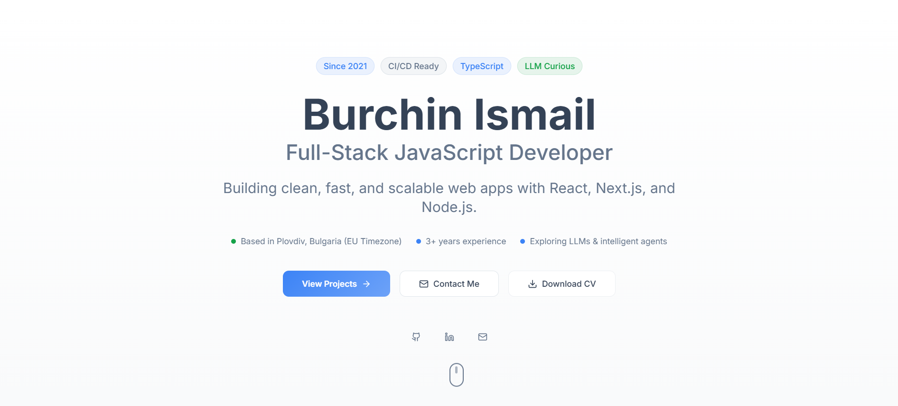

# 🧑‍💻 Burchin Ismail – Developer Portfolio

> A modern, clean, and fast developer portfolio built with **Vite + React + TypeScript + Tailwind CSS + Radix UI**.

🎯 **Live site:** [https://my-portfolio-2025-pink-five.vercel.app/](https://my-portfolio-2025-pink-five.vercel.app/)



---

## ✨ About This Project

This is my **developer portfolio site**, showcasing my:

- 🧠 Tech stack & skills
- 💼 Selected projects
- 👨‍🔧 Professional background
- 📫 Contact information

It’s built for performance, accessibility, and responsiveness — optimized for recruiters, collaborators, and potential clients.

---

## 🛠️ Tech Stack

| Category                 | Tools & Libraries                                |
| ------------------------ | ------------------------------------------------ |
| **Frontend**             | React, TypeScript, Vite                          |
| **Styling**              | Tailwind CSS, Tailwind Typography, ShadCN UI     |
| **UI Components**        | Radix UI, Lucide Icons                           |
| **Forms & Validation**   | React Hook Form, Zod                             |
| **Animation & Feedback** | Tailwind Animate, Sonner Toasts, Vaul Animations |
| **Charts & Visuals**     | Recharts, Embla Carousel                         |
| **Routing & State**      | React Router DOM, TanStack Query                 |
| **Theme Support**        | Dark mode via `next-themes`                      |

---

## 📁 Project Structure

```
vite_react_shadcn_ts/
├── src/
│   ├── components/         # Reusable UI components
│   ├── pages/              # Routes and page layouts
│   ├── assets/             # Images and static files
│   ├── lib/                # Utility functions and hooks
│   ├── config/             # App-wide configuration
│   └── styles/             # Tailwind and global CSS
├── public/                 # Public assets
├── index.html              # Entry HTML
└── package.json            # Dependencies and scripts
```

---

## 🚀 Getting Started

To run this portfolio locally:

### 1. Clone the repo

```bash
git clone https://github.com/burcinismail8/my-portfolio-2025
cd your-portfolio
```

### 2. Install dependencies

```bash
npm install
# or
yarn
```

### 3. Start the development server

```bash
npm run dev
```

The app will be running at [http://localhost:5173](http://localhost:5173)

---

## 🔍 Features

- ⚡ Lightning-fast performance with **Vite**
- 🌙 Dark mode support
- 📱 Fully responsive design
- 🛠️ Accessible components (Radix UI)
- 🧩 Modular codebase
- 📤 Easy to deploy (Vercel / Netlify / GitHub Pages)

---

## 👤 About Me

I’m **Burchin Ismail**, a Full-Stack JavaScript Developer focused on building clean, fast, and scalable web apps using React, Next.js, and Node.js.

🧠 Currently exploring LLMs and autonomous agents.  
🌍 Based in Plovdiv, Bulgaria

---

## 📫 Contact

- 📧 Email: [burcinismail8@gmail.com](mailto:burcinismail8@gmail.com)
- 💼 LinkedIn: [https://www.linkedin.com/in/burchin-ismail-8289b7195/](https://www.linkedin.com/in/burchin-ismail-8289b7195/)
- 🧑‍💻 GitHub: [https://github.com/burcinismail8](https://github.com/burcinismail8)

---

> Last updated: September 2025
